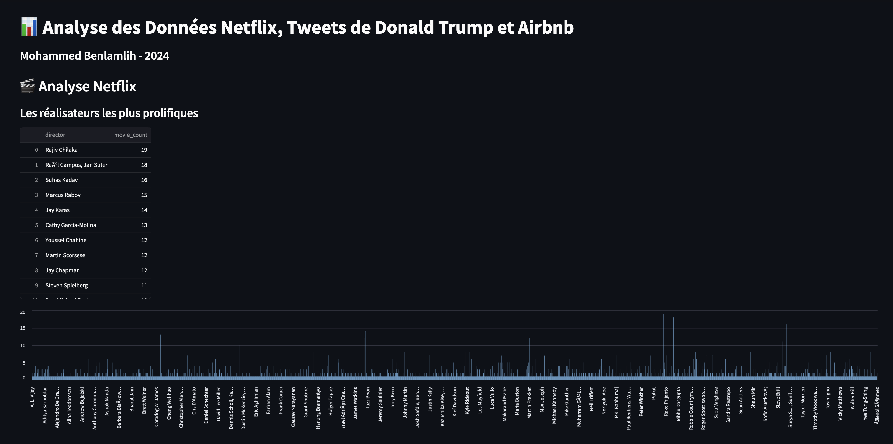
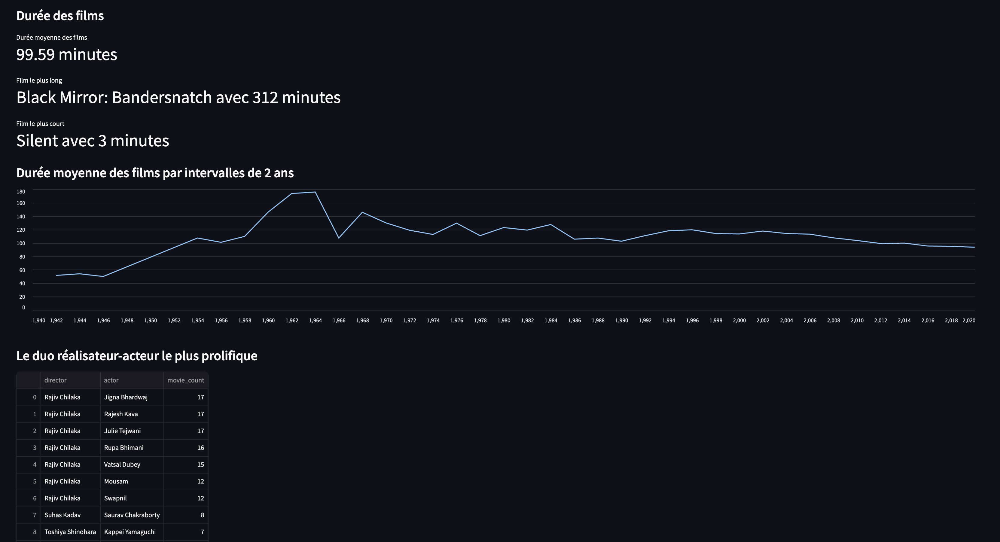

# Spark Class Project Assignment

## Overview
This project contains three Python files for data analysis using Spark. The files included are:

- `airbnb_data.py`
- `netflix_data.py`
- `twitter_data.py`

You can run these files using Python 3 to get all the results required by the exercise. However, for better visualization of the data, it is recommended to run the Streamlit server, which contains more visual elements.

Below are some screenshots of the UI:





## Setup Instructions
1. Clone the repository.
2. Ensure you have Python 3 installed.
3. Install the required dependencies using:
   ```
   pip install -r requirements.txt
   ```
4. Download the dataset using `curl` and unzip it into the `datasets` directory.

```sh
curl -o datasets/listings.csv.gz https://data.insideairbnb.com/united-kingdom/england/london/2024-03-19/data/listings.csv.gz
gunzip datasets/listings.csv.gz

```
4. Run the desired script using Python or start the Streamlit server for interactive visualization.

## Running the Scripts
To run the scripts, use the following command:
```
 streamlit run streamlit_app.py
```

## Running the Scripts
To run the scripts, use the following command:
```
python3 data_sources/<script_name.py>
```

## Streamlit Visualization
For enhanced data visualization, use the Streamlit application. The Streamlit server provides a more interactive and visual approach to analyze the data.

## Dependencies
- The primary tool used for data analysis is Spark.
- Pandas is used in the Streamlit files because the framework requires it, but all the analysis is done using Spark.

## Data Sources
- **Airbnb Data**: The latest file as of June 7, 2024, was obtained from [Inside Airbnb](https://insideairbnb.com/).
- **Netflix Data**: Data for Netflix analysis.
- **Twitter Data**: Data for Twitter analysis.

All the datasets used are included in the repository within the `/datasets` folder.

## Notes
- Ensure that the datasets are in the `/datasets` folder for the scripts to run correctly.

